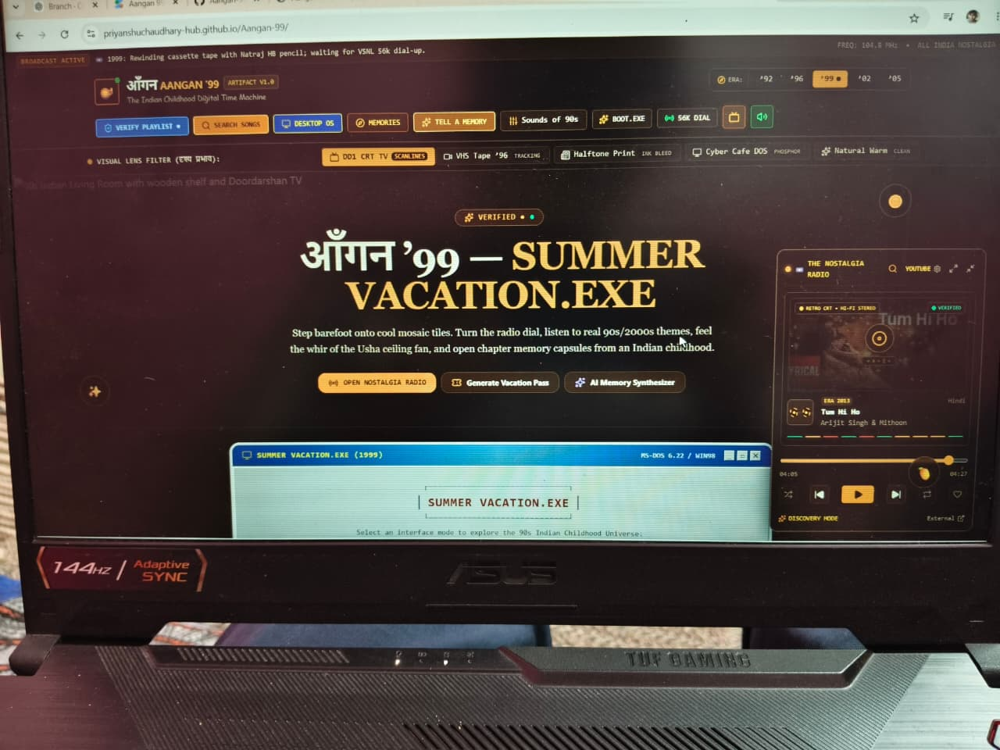

<div align="center">

# 🏡 Aangan '99

### *Indian Childhood Nostalgia Machine*

A retro-inspired web experience that recreates the warmth of Indian childhood memories from the **90s and early 2000s** through CRT aesthetics, nostalgic music, and interactive memory capsules.

[](https://priyanshuchaudhary-hub.github.io/Aangan-99/)
[]
[]
[]
[]

</div>

---

## 📸 Preview

### Nostalgia Radio

### Memory Explorer


> A retro CRT-style music player inspired by the golden era of Indian memories.

### 🎬 Live Experience

> Add your uploaded demo video here as demo.mp4 and GitHub will show it directly.

---

## 🌐 Live Website

**🔗 https://priyanshuchaudhary-hub.github.io/Aangan-99/**

---

## ✨ Features

- 📺 CRT television inspired UI
- 📼 Cassette-era nostalgic design
- 🎵 Nostalgia Radio with retro player
- 🖥️ Desktop-style interactive interface
- 🔍 Memory Explorer experience
- 🌙 Vintage glow & scanline effects
- 📱 Fully responsive layout
- ⚡ Fast loading with Vite

---

## 🛠 Tech Stack

| Technology | Purpose |
|------------|---------|
| React | Frontend |
| TypeScript | Type Safety |
| Vite | Build Tool |
| CSS | Retro Styling |
| GitHub Pages | Deployment |

---

## 📂 Project Structure

```text
Aangan-99/
├── src/
├── assets/
├── public/
├── .github/
├── package.json
├── bun.lock
├── vite.config.ts
└── README.md
```

---

## 🚀 Run Locally

Clone the repository.

```bash
git clone https://github.com/PriyanshuChaudhary-hub/Aangan-99.git
cd Aangan-99
```

Install dependencies.

### Bun (Recommended)

```bash
bun install
bun run dev
```

### npm

```bash
npm install
npm run dev
```

Open:

```
http://localhost:5173
```

---

## 🎯 Inspiration

Growing up in India meant:

- 📻 Listening to songs on old radios
- 📼 VHS and cassette memories
- 💻 Cyber cafés
- ☀️ Summer vacations
- 🎮 90s & 2000s nostalgia

**Aangan '99** transforms those memories into an interactive digital experience.

---

## 🔮 Future Roadmap

- [ ] More nostalgic music collections
- [ ] Interactive memory capsules
- [ ] CRT boot animation
- [ ] Additional retro sound effects
- [ ] Accessibility improvements
- [ ] SEO optimization

---

## 👨‍💻 Developer

**Priyanshu Bharangar**

- GitHub: https://github.com/PriyanshuChaudhary-hub
- LinkedIn: https://www.linkedin.com/in/priyanshu-bharangar

---

<div align="center">

### ⭐ If this project brought back memories, don't forget to star the repository.

*"Some memories never fade—they just wait for someone to replay them."*

</div>
